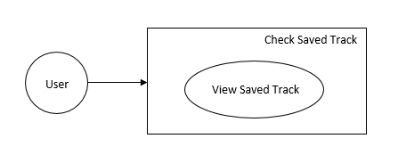
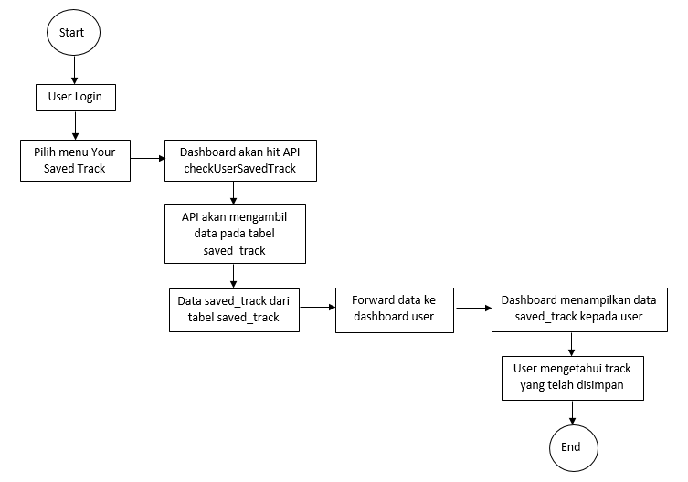
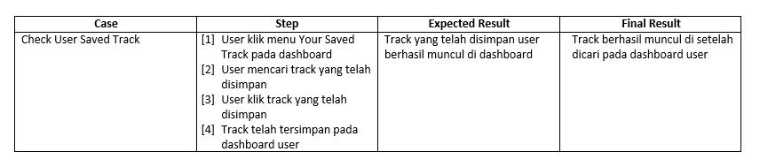
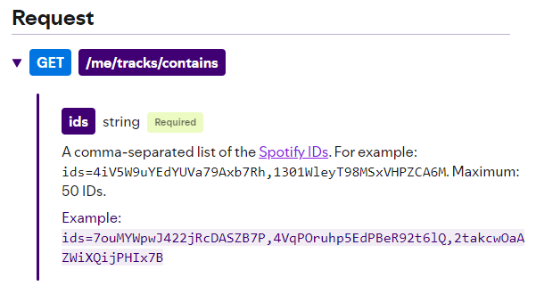
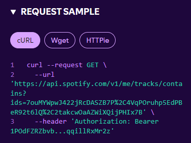
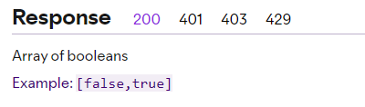
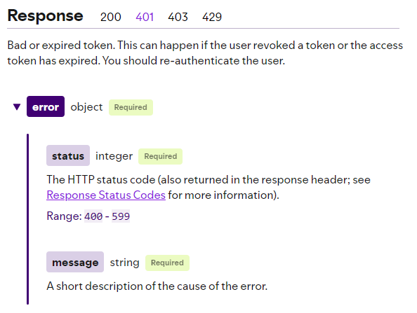
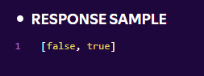
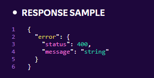
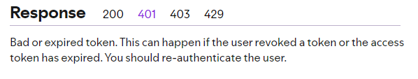

# Dokumen Teknis Spotify - Fitur Check Track Lagu yang Tersimpan oleh User Spotify 

**Dokumen ini berisi study case pembuatan dokumen teknis suatu fitur pada aplikasi Spotify, mencakup beberapa jenis dokumen.**

### List Dokumentasi:
### [SRS Documentation](#srs-documentation-1)
### [UAT Documentation](#uat-documentation-1)
### [API Documentation](#api-documentation-1)
### [SOP Documentation](#sop-documentation-1)

_klik pada jenis dokumen yang ingin Anda baca_
##

### SRS Documentation 
**1. Latar Belakang**: Sebelumnya user hanya dapat menyimpan track lagu tanpa bisa melihat track apa saja yang sudah mereka simpan. Sehingga banyak user yang berulang kali mencari dan mengecek ulang apakah user sudah menyimpan track yang ingin user simpan.

**2. Goals**:\
a. Memudahkan user untuk melihat track apa saja yang sudah disimpan.\
b. User tidak perlu berulang kali mencari dan mengecek kembali track yang ingin disimpan.

**3. Project Scope**:\
a. Product\
b. Project Management\
c. Front-end\
d. Back-end\
e. UI/UX\
f. Data

**4. Requirement**\
a. Front-end: Membuat satu implementasi UI, prioritas High\
b. Back-end: Membuat satu API baru, prioritas High\
c. UI/UX: Membuat satu UI baru, prioritas High\
d. Data: Membuat satu table baru, prioritas High

**5. General Process**\

**6. Business Flow**\

##### [Back to List](#list-dokumentasi)

##

### UAT Documentation 
**1. Rincian**
- Nama proyek: Testing fitur check user saved track
- Pihak yang terlibat: User, Developers, Expert
- Tanggal Pengujian: 23 Desember 2025
- Versi: 1.0.0

**2. Testing Scenario**:\

##### [Back to List](#list-dokumentasi)

##

### API Documentation
**1. API Specification**\
a. Nama API: checkUserSavedTrack\
b. URL: v1/me/tracks/contains\
c. Method: GET\
d. Description: API ini dipakai untuk mengambil data tentang track yang disimpan oleh user pada table saved_track. 

**2. Request Param**:\

**3. Request Sample**:\

**4. Response Param**\
\

**5. Response Sample**\
\

**6. Error Code & Message**\
\

##### [Back to List](#list-dokumentasi)

##

### SOP Documentation
**1. List of Process**
- Nama process: Get check user saved track
- Step: proses ini dijalankan oleh scheduler oleh system pada jam 12.00 di setiap hari. Proses ini akan mengecek apakah suatu track telah tersimpan dalam playlist di dashboard user Spotify
- Scheduler: Setiap jam 12.00 di setiap hari. 

**2. Monitoring**:
- Cek proses check user saved track: Proses ketika system mengambil data semua track yang telah tersimpan. 

**3. Troubleshooting**:
- Problem issue: Data track tersimpan tidak dapat terambil
- Step Troubleshooting:\
  (1) Cek log dari proses check user saved track, apakah ada format hari yang salah.\
  (2) Jika ada format yang salah, maka ubah format hari menjadi hari ini.\
  (3) Kemudian jalankan proses secara manual, yaitu menjalankan API checkUserSavedTrack pada environment production secara manual.\
  (4) Jika tetap ada issue, maka hubungi PIC terkait.

##### [Back to List](#list-dokumentasi)

##